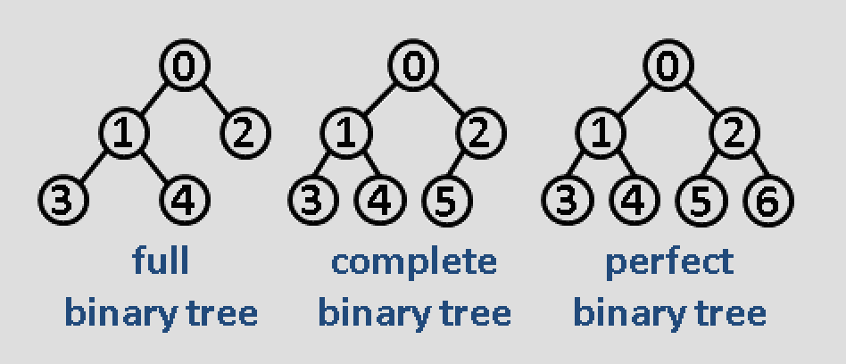

# Binary Tree

## Benefits of Trees
- gives structure to data
  - represent hierarchies
- efficient insertion and search
- very flexible data structure, allows subtrees to move around with min effort (...?)

## Definitions
- **search path**: sequence from root to node
- **ancestor**: if a node lies in a node's search path
- **descendant**: if node has an ancestor (also, descendant of itself)
- **depth**: number of nodes in search path
- **height**: max number depth of tree (doesn't include root)
- **level**: all nodes on same depth in tree

## Types of B-trees
- **full binary tree**: every node other than leaves have 2 nodes (eg all nodes have either 2 or zero children)
  - number of non-leaf nodes = num leaves - 1
- **perfect binary tree**: full tree where all the leaves are on the same level (sometimes called complete binary tree...)
  - num nodes = 2^(h+1) - 1
- **complete binary tree**: like perfect btree but don't care about last level and all nodes are as far left as possible
  - provides best relationship btwn num nodes and height: at most O(log N)

- **skewed**: if no node has right children, then **left-skewed tree**, vice versa
  - gives max h: O(n)

## Traversing
- breadth-first traversal
  - **Level Order Traversal**
    - walks to nodes by levels from top to bottom from left to right
- depth-first traversal:
  - **Preorder Traversal**
    - root
    - traverse left
    - traverse right
  - **Inorder Traversal**
    - traverse left (all the way down left)
    - root
    - traverse right
  - **Postorder Traversal**
    - traverse left (all the way down left)
    - traverse right
    - root

- **Euler Tour**
  - combines all three traversals in one algorithm, each node will be visited 3 times
  - visit node from left (preorder), from below (inorder) and on right (postorder)

## Complexity
For traversals
  - time is **O(n)**
  - space is call stack's max depth, so O(h)
    - remember, h's min is **O(log n)** (balanced trees) and max is O(n) (skewed)
    - but! can reduce space to O(1) by using existing tree nodes
  - recursive usually used
  - if node has **parent field**, use it to reduce time/space

**Note: not all single children (no siblings) are leaves!**
Ex: 5 is a single child but not a leaf!

## Extra readings:
- [great overview of trees](https://www.cs.cmu.edu/~adamchik/15-121/lectures/Trees/trees.html)
- [practice problems](https://www.cs.cmu.edu/~adamchik/15-121/lectures/Trees/questions.html) / [solutions](https://www.cs.cmu.edu/~adamchik/15-121/lectures/Trees/answers.html)
