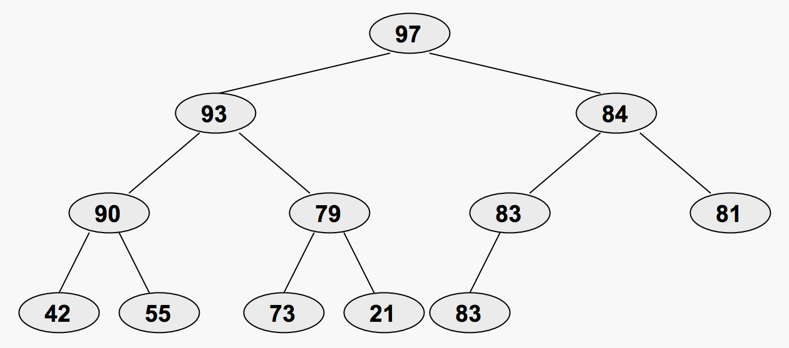
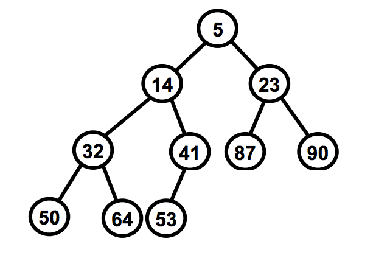

# Heaps

A **heap** is a specialized *complete* binary tree
  - ie every level, except maybe the last, is filled AND all nodes are as far left as possible
  - heap property:
    - **max-heap** max at top
      key at each node >= keys of its children
      
    - **min heap** min at top
      key at each node <= keys of its children
      
  - can be implemented as an **array**:
    - children of node at *i* are at *2i + 1* and *2i + 2*
  - AKA **priority queue*** bc behaves like queue but each el has a 'priority' assigned to it. deletion removes el w/highest priority
  - insertion: **O(log n)**
  - max (or min) el lookup: **O(1)**
  - max (or min) el deletion: **O(log n)**
  - other el search: **O(n)**
